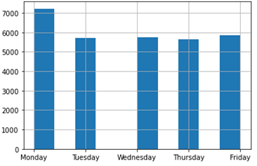
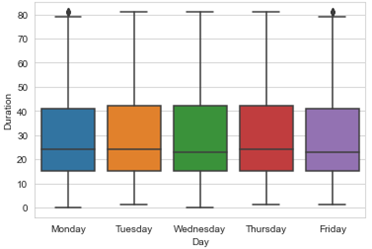
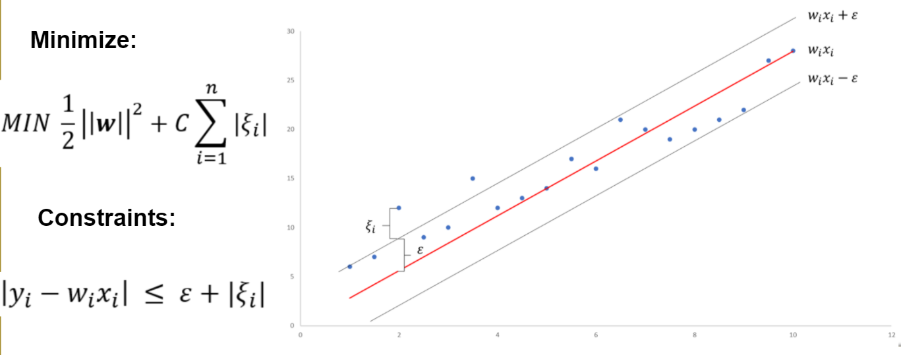
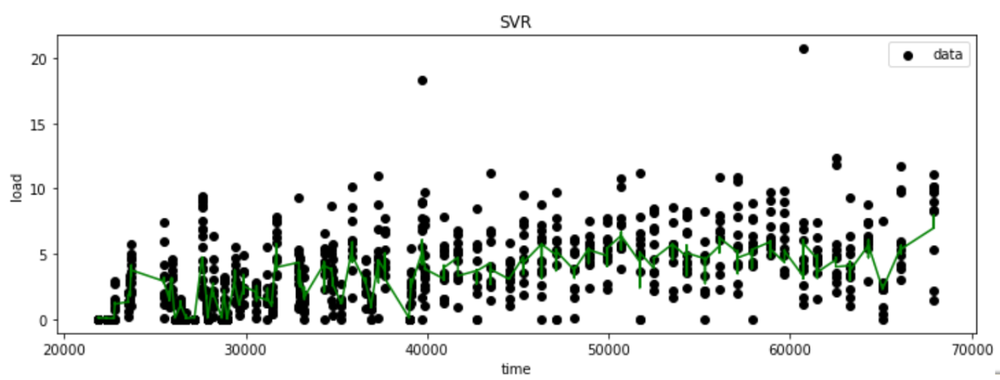

# Chapter 1. Introduction

As part of the course project for the class, project group 7 acquired bus ridership per trip weekday data (from here on referred to as **bus data**) for the month of August from the Champaign-Urbana MTD bus organization (CUMTD). To supplement the bus data, CUMTD provided a manual that explains the process and methodology used to track, monitor and acquire the bus data. Figure @fig:wide-image gives an overview of the CUMTD area.

{#fig:wide-image}

## 1.1 Background
Bus operations are complex systems as they function at the intersection of transportation infrastructure and planning based on continually evolving user patterns.
If we can predict the passenger loads, bus system can be run more efficiently and economically. Therefore, we investigated the ridership of the CUMTD bus system to attempt to find the optimal way to predict load averages (avg # of passengers onboard during a trip). 

## 1.2 Dataset Overview
We received 3 datasets containing route performance and bus ridership data from CUMTD. For this project, we focused on the bus ridership per trip weekday data for the month of August. We will find the most appropriate variables for the accuracy of our prediction, and choose the optimal machine learning model for Kaggle competition. Table @tbl:constant-digits shows the first five data in the dataset 'df_ridership' where we are going to analyze. 

'df_ridership' dataset shows the ridership situation and has 30171 data points. Its index includes the line number, trip ID and the date, and it has block ID, course ID, pattern name, scheduled start time, scheduled end time, P-stops, M-stops, vehicle ID, vehicle type name, capacity, full capacity, practical capacity, load factor, practical load factor, total boarding number, total alighting number, average load, minimum load, maximum load, passenger miles, and passenger miles factor. In specific, M-stops means that the number of stops at scheduled stop points, P-stops means that the number of stops at scheduled stop points and of unscheduled stops with passenger interaction.

| No | Date| Trip| Duty| Line| Block | Course|	Pattern|	Sched. start|	Sched. end|	P-Stops|	M-Stops|	Vehicle|	Veh. type|	Capacity|	Full capacity|	Capacity (pract.)|	EMPTY_1|	Load factor [%]|	Load factor (pract.)[%]|	EMPTY_2|	Total in|	Total out|	Load avg|	Min|	Max|	EMPTY_3|	PM|	PM factor [%]|	Graphic|
|:-----------------|:-------------:|:-------------:|:-------------:|:-------------:|:-------------:|:-------------:|:-------------:|:-------------:|:-------------:|:-------------:|:-------------:|:-------------:|:-------------:|:-------------:|:-------------:|:-------------:|:-------------:|:-------------:|:-------------:|:-------------:|:-------------:|:-------------:|:-------------:|:-------------:|:-------------:|:-------------:|:-------------:|:-------------:|:-------------:|
|1|	8/3/2020|	4214|		BLUE[V:0001]|	402|	1290495|	124.0.137636458|BLUE 3|	6:43:00|	7:03:00|	0|	3|	1727|	NEWFLYER(2017)|	0|	0|	0| |		0|	0| |		0|	0|	0|	0|	0|	|	0|	0|	|
|2|	8/3/2020|	22|		BLUE[V:0001]|	402|	1290495|	124.0.137636458|BLUE 51|	7:03:00|	7:35:00|	5|	52|	1727|	NEWFLYER(2017)|	0|	0|	0| |		0|	0| |		2|	2|	1|	0|	2|	|	7.02|	0|	|
|3|	8/3/2020|	332|		BLUE[V:0001]|	402|	1290495|	124.0.137636458]|4W 3|	7:40:00|	8:13:00|	4|	53|	1727|	NEWFLYER(2017)|	0|	0|	0| |		0|	0| |		1|	1|	0|	0|	0|	|	0|	0|	|
|4|	8/3/2020|	30|		BLUE[V:0001]|	402|	1290495|	124.0.137636458]|BLUE 51|	8:17:00|	8:51:00|	8|	52|	1727|	NEWFLYER(2017)|	0|	0|	0| |		0|	0| |		2|	2|	0.6|	0|	2|	|	4.68|	0|	|
|5|	8/3/2020|	201|		BLUE[V:0001]|	402|	1290495|	124.0.137636458|4W 3|	8:51:00|	9:24:00|	7|	52|	1727|	NEWFLYER(2017)|	0|	0|	0| |		0|	0| |		3|	3|	0.5|	0|	2|	|	4.27|	0|	|

Table: Ridership Per Trip in August Weekdays
{#tbl:constant-digits}

## 1.3 Project Objective 
Group 7's project objective is to use the bus data to predict the buses load averages (average number of passengers onboard during a trip). This project is of particular interest to CU-MTD because in 2020, the bus load averages have significantly decreased due to the COVID-19 pandemic. Therefore, any results or conclusions that help CU-MTD better predict the load averages could increase their operating efficiencies and minimize costs.

## 1.4 Full Report Structure
The report was developed using Manubot to allow for a collaborative effort among the 6 group members. The explaratory data analysis (EDA) and model were developed using Python 3 in a Kaggle Notebook and Jupyter integrated development environment (IDE). The content in the following report is broken down into the following 4 main chapters:

1. **Introduction** - The current chapter which introduces the project scope and objective.
2. **Exploratory Data Analysis** - This chapter details the EDA process, findings and key takeaways.
3. **Model Development** - This section describes the step-by-step methodology used to determine the best model to predict the load averages.
4. **Conclusions** - This section briefly highlights the key takeaways from the model development efforts and the report in general.

# Chapter 2. Exploratory Data Analysis

The content in chapter 2 is broken down into the following 3 sections:

1. **Data Tidying** - This section discusses how the raw bus data was cleaned and prepared for the EDA analysis. The section also details the independent and dependent variables used in the analysis.

2. **Investigating Data Insights** - This section details the bus data EDA process and outcomes.

3. **EDA Summary and Conclusions** - This section summarizes the key findings and conclusions from the EDA.

## Data Tidying 

### Independent Variables

The CU-MTD bus data was provided as a csv file. Therefore, the easiest way to setup, tidy and initially analyze the data was in tabular form. 
The bus data was then assessed for meaningful ways it can be subdivided based on identifying independent variables. As shown in figure 1 below, the number of trips are fairly evenly distributed throughout the week.

Notice that Monday, the start of the work week, has the most trips. Since we only have 1 month of data (August), no strong conclusions can be made at this point.
The following section summarizes the EDA results that are relevant to the model development effort.

### Dependent Variables

One of the unique challenges faced in this data was what to do with the time data (schedule start and end times). Firstly, the data was provided as strings, therefore, they needed to be converted to datetime format. Secondly, some of the data entries that were not on the conventional 24-hr time format, i.e., some times were between 24:00 and 26:00 hours. This is likely because the timestamps represent the bus driver workshifts. Workshifts are easier to monitor and track on a continous scale from clock-in to clock-out than to break-up because of the start of a new day. A function was created to correct the time to be in the 24-hr format then the times were used to determine the duration of a trip (schedule end time - schedule start time).

## Investigating Data Inisghts

First, we dropped all the empty columns and columns with categorical values or string values, which can not be used as inputs to train the model. Then a heatmap is used to show the pair-wise correlation between the remaining features and our target 'Load avg', which gives us an idea which features might be the most predictive and which features we should drop because of a poor correlation with our target. 

Then, a pairwise scatter plot is used to show the degree of linearity of the relationship between each feature, which gives us a rough idea as to what kind of model should be used.

Also, for CUMTD, different bus lines serve specific groups of people. In this way, it is important to find the characteristic of each bus line during August. First, we create different Dataframe for different bus line. Since the bus name is not easy to show in graphs, we use [Number of Routes' Names in CUMTD](http://mtd.org/maps-and-schedules/routes/) to instead. For some bus line which has different types of bus number based on different routes or different service timeline (for example, 1 Yellow serves during weekdays’ morning and afternoon, and 100 Yellow serves during weekdays’ evening and the whole weekends; 5 Green have normal line and express line or hopper line which similar but different routes), we separate all of them into different name and expressions. After that, we pick up their statistic of “Load Average” in average, and combine with comparison, showing as below. (Note: In the left figure, "Ex" stands for express buses, "H" stands for Hopper, "L" stands for late night buses, "M" stands for maintenance buses and "T" stands for training buses)

.png){#fig:square-image}

*Note: In the left figure, "Ex" stands for express buses, "H" stands for Hopper, "L" stands for late night buses, "M" stands for maintenance buses and "T" stands for training buses*

What's more, to compare the characteristic of each bus line on each day of August, we separate the load average in each into different serving days, which shows as below. Moreover, to find its own difference of each bus route, especially the difference between summer holidays and the opening week of the new semester, we combine the load average of each line in different days and plot them together, which shows as below.

{#fig:tall-image height=10in}

{#fig:tall-image height=10in}

With these comparisons, some takeaways can be summarized as follows:

* There were only a few increasement after semester opened. It shows that the pandemic decreases the students' willingness of taking buses to face-to-face classes.
* In August, the YELLOW, RED, LAVENDER, GREEN and GREY buses have relatively high passengers.
* The Illini routes changed the most after semester started, we believe one of the reasons is that students who live in One North or One South must take buses to the classroom.

## EDA Results Summary

The following section summarizes the EDA results that are relevant to the model development effort. Through the EDA of the bus data the following information was noted about the data set:

* The data set only includes weekday trips and the data is fairly evenly distributed.
* “Line” is the name of the bus line, which is what most riders are familiar with. There are 38 unique bus lines and 11 of them that do more than 10 trips per workday.

* The data has 6 categorical features – with the exception of pattern, the other 6 features will be used in the model development effort.
* 24 numerical features – the following features wil be used in the model: P-stops, total in and total out (flux?), and PM.
* The label is the load avg.

The following features were identified to have strong predictive ability, indicated by a high correlation with the label (correlation in parenthesis):
* P-stops (0.61).
* Total in (0.78) and total out (0.78).
* Max (0.90).
* PM (0.85).

# Chapter 3. Feature Engineering and Data Preprocessing

## Feature Engineering

Feature engineering is a process to select features that can improve the performance of prediction model from raw data based on domain knowledge. Removing features that are not relevant to the predictions or contribute specifically to the predictions will make your model's work easier and faster to learn.

Similar steps are taken in this section as were taken in the EDA process. However, the overall goal here was to clean the data in such a way that it produces informative, predictive models with minimal bias and over- or under-fitting. Therefore:

- The data field was converted a day of the week.
- The bus lines can be cleaned so that they match a format familiar to riders.
- The start and end times are converted such that they reflect times and the difference between the start and end time is stored in the data sets as a **'duration'**.

The following paragraphs describe the particular ways the training data was cleaned to result in meaningful predictive models. The 2 main ways feature engineering will be conducted on this data set are: 1) The developers knowledge on the dataset (as presented in the EDA), and 2) assessing the statistics on the dataset.

## Data Preprocessing

Data preprocessing is an indispensable step in machine learning. It is important to preprocess the data which should be prior to model development since the quality of the data can determine the final performance of our model.

### Handing Missing Data

Data in the real world always have few missing values. This phenomena may be due to many reasons. There are many methods to handing missing values such as ignore the data row with missing value, replacing the missing value with mean or median value. **Table x** shows the top 8 percentage of missing value for each feature. 1.0 means all the values are missing. 0.0 means none of the data is missing. Here, the missing value of ‘Trip’ are filled with the mean of all the existing 'Trip' values. From the table we can know the eighth large of the percentage is already 0, which proves that there is no missing data for other features not appearing in the table.

**Table x** Percentage of Missing Value

### Feature Scaling

Feature scaling is a method used to standardize independent variables or feature ranges of data. Since the value range of some original data is very different, the model will give more weight to the feature with large values in the learning process. However, in fact, the weight of each feature should not be considered in this way. In some machine learning algorithms, the objective function cannot work properly without normalization.

**Figure #. Comparison of key predictive variables against load average.**

#### Standardization (Z-score Normalization)

In the standardization, the core idea is to convert each feature in the data so that the mean value of each feature is 0 and the standard deviation is 1. The general method of calculation is to determine the distribution mean and standard deviation for each feature. The formula showing how to transform the values is shown as follow.

**Figure x. Z-score Normalization**

### Converting Categorical Features to Numerical

To allow the model to learn from the categorical features, they need to be converted to numerical features. The following section details how the conversions were conducted.

### One-hot coding

Since most machine learning algorithms require numerical input and output variables. We have three categorical data now. We can use the one hot encoding to convert categorical data to integer data. **Figure x** is an example of how a dataframe looks like after one hot encoding. In python, we can use panda’s ‘pd.get_dummies’ function to achieve this. however, we find that the accuracy of model will be less after adding the these three features into our training data. Then we decided to drop all of them.

**Figure x. One-hot Coding Example**

- The EDA revealed that there are 39 unique lines that conduct a wide range of rides from 2 to 1,300. Since the line is a strong predicator of bus loads (i.e., popular lines will likely have larger loads), the line were converted via one-hot encoding.
- The EDA revealed that there are 7 unique vehicle types that conduct a wide range of rides from 452 to 9,414 . Since the vehicle type is a strong predicator of bus loads (i.e., larger vehicles can carry larger loads), the vehicle type was also converted via one-hot encoding.
- Similar logic as above was used to convert the week days using one-hot encoding.

In our project, We create a function called "preprocessing" which including serval functions to deal with different data as we discussed earlier. Feature engineering, Handing Missing data, Feature scaling and One-hot encoding method are included in this function.

### Cross-validation

In order to flag problems like overfitting or selection bias, we can do the cross-validation. Cross-validation is a technique in which we train our model using the subset of the data-set and then evaluate using the complementary subset of the data-set. This step is done to minimize the likelihood of creating a model that will over or underfit the data. To do the Cross-validation, we should split a part of original traning data as a validation set. In this case, I split the training set into X_train (80% of the original size of train_data) and X_validation (20% of the original size of train_data).

# Chapter 4. Model Development Process

The follow sections goes through a step by step process to develop and identify the best model to predict the load average on the test data.

### Establish a Baseline Model

Before building a complex model a baseline model was created that simply returns the load average using a fairly straight-forward support vector regression (SVR) model. SVR models are similar to linear regression models except that they minimize the model's coefficients as opposed to the sum of the squared errors. In addition, SVR provides the flexibility to define an acceptable error level. The model then finds the best fit line to the data points. The figure below illustrates an SVR model.

The SVR developed in this project resulted in an accuracy of 47 percent and a root mean squared error of 2.44 and is shown in the figure below.

As expected, the baseline model does not fit the data well. The next section assesses if more complex models can produce results and performance.

### Develop a More Complex Model

As can be seen, the dense linear model results in better (lower) metrics than the baseline model. However, the improvement in the model performance is not that significant. The next section assesses if a dense non-linear model can produce a better model with lower metrics.

### Neural Network Model

The neural network model has been taken in our team. As a subfield of machine learning, neural network model would input data, and then train themselves to recognize patterns found in data, finally output a set of similar data. Therefore, choosing neural network would process the data like human brain. In our project, it works very well and precisely, and predicts a correspondingly positive relationship between predictions and targets, shown in the **Figure #**. The targets are validation value, and the perditions are predicted value. As the result shows, predictions and targets are very consistent. The detail coding process would show as follows.

**Figure #. Comparison between predictions and targets.**

A typical neural network model would have three kinds of layers, which are input layer, hidden layer, and output layer, shown in **Figure #**. Among our teams, one of our neural network models contains 4 layers, composed by 1 input layer, 2 hidden layers, and 1 output layer. Both dense in hidden layers are 128, which is shown in Appendix. 

**Figure #. Nenural Network.**

When processing the code, in the training part, take learning rate to adjust weight correction. The formula is shown in **Figure #**. In every time, input signal into neural network model, and multiple learning rate, local gradient could correct the model sequentially. After all process done, the model would be optimized as precise as possible, similar to human brain. 

**Figure #. Weight correction.**

In the neural network model, find an optimum way to weight correction is crucial. If a network performs well on the training data but very badly on testing set, the network might be over-trained, which is overfitting. On the other hand, if the network works bad on the training data, the network might be under-trained, which is underfitting. Besides, an under-trained network also performs badly on the testing set. A drawing to compare these would be shown in **Figure #**.

**Figure #. Plot in overfitting,optimum, and underfitting.**

To make the predictions match well in validations, batch mode would be applied in this model. In the batch model, the weight updating is performed when all samples in the epochs are presented to the network. In this model, the epoch is 40, which means there are 40 times to wight the model. 

After the optimization as stochastic gradient descent (SGD), take learning rate as 0.1, the RMSE is 0.268, and the R2 score is 0.965. 

### Most Predictive Model

**My model was best with relu layers and dropout regularization only. Would probably be even better if it had automatic hyperparameter and parameter selection!(kundayi)**

Our best mode is a type of neural network model developed by Yujing using the sklearn package. The name of model is **Gradient Boosting Regressor**.

*	The basic idea of Boosting is to combine several weak learners into a stronger one.

*	Boosting models try predictors sequentially, and the subsequent model attempts to fix the errors of its predecessor.

*	Gradient boosting is a type of boosting algorithm. It relies on the intuition that the best possible next model, when combined with previous models, minimizes the overall prediction error. 

The Hyperparameters used in the model are shown as follow. The reason why each parameter has more than one number is that we also use the **grid search** method.
*	max_depth: [3, 10]
*	learning_rate: [0.1, 0.03]
* n_estimators: [100, 250, 500]

Sometimes we can improve models' performance by tuning the hyperparameters. Using grid search an operation technique called can help us finding the optimal combination of hyperparameter values. Grid search is a brute-force exhaustive search paradigm.

After combing the GradientBoostingRegressor and GridsearchCV, the **root mean squared error** is **0.165**, and the **R2 score** is 0.985

The following figure shows the predictions against targets. The straight line represents the function y=x. 

* If a point falls on this line, then for this input we can know prediction = target.

* If a point falls over this line, then for this input we can know prediction > target.

* If a point falls below this line, then for this input we can know prediction < target.

* The farther the point is from the line, the less accurate the prediction.

**Figure x. Predictions VS Targets**

# Chapter 5. Conclusions

As was shown in chapter 4 the most predictive model was able to predict the load average with 0.98 accuracy. Some factors need to be taken into consdieration about this process:

1. A significant amount of pre-processing was used - To make this model more cost- and time-effective the input data needs to be tidy before going into the data. This can be achieved by changing the way the data is stored or creating classes and functions that automatically clean the data.
2. Reliablity - This model was developed using data from a single month from 2020 (August). Therefore, although the model had high predictive potential with the August data. It is possible that the model is not able to accurately predict load averages for other months were passenger habits may significantly differ (e.g., middle of summer, winter or spring). Thererfore, to truly optimize the model a larger year round data set is recommended. It would probably be best to train the model using at least 1 month of data from the 4 seasons of a year.

